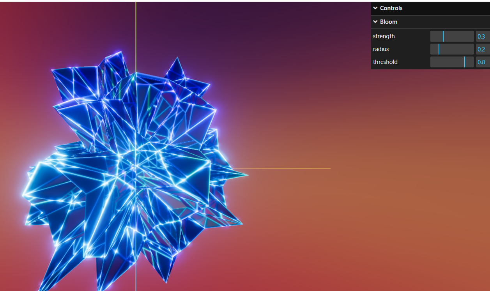

# threejs-vite-template

> A native Three.js template built with Vite and TypeScript



```
pnpm run dev
```

- support githupPage depoly
set `.env.production` `VITE_BASE_URL` to your repo name
*THEN*
```
pnpm run depoly
```

- use three/webgpu by default
<!-- - use `tsl-uniform-ui-vite-plugin` auto generate uniform value pane -->
